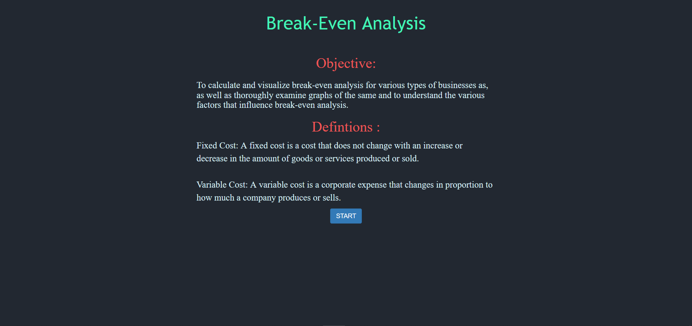
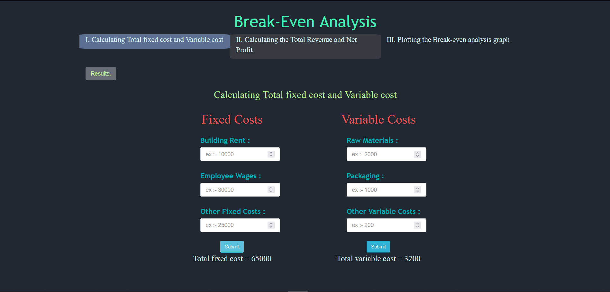
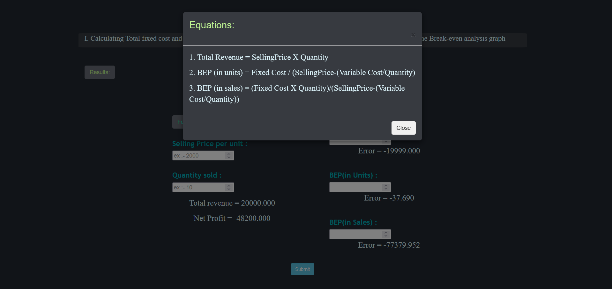
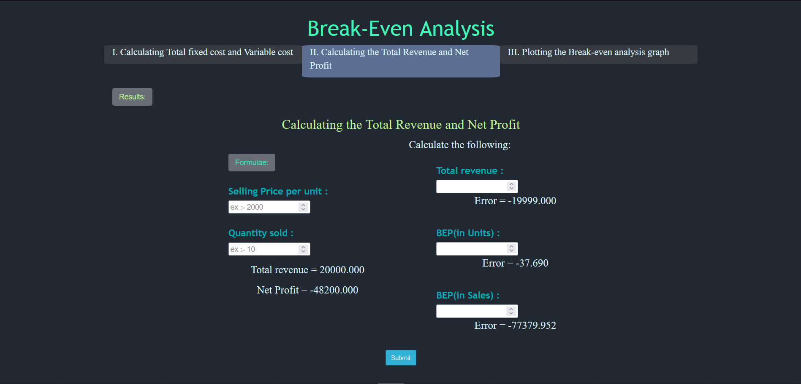
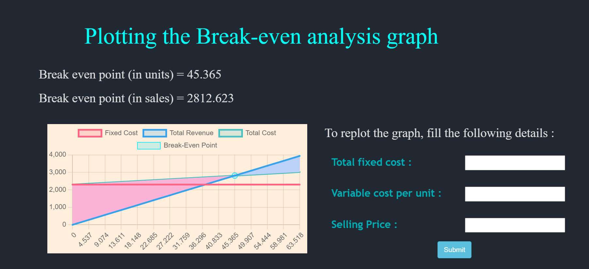

##### These procedure steps will be followed on the simulator

1. After going through the theory and pretest, click the "Simulation" tab 

2. Click "Submit" button to verify the answers given, click on simulator button to skip the test and go to simulator. 
<!--   -->
3. Read the objective and click on the "Next" button to proceed. 
 
4. Understand the definitions and click on the "Next" button 
 
5. Input the values of fixed cost and variable cost, then click on the "Next" button. 
 
6. Input the values of selling price and quantity sold, then click on the NEXT button. 
 
7. Analyse the graph and input values to replot the graph and visualize the effect of each variable on the graph. 
 

