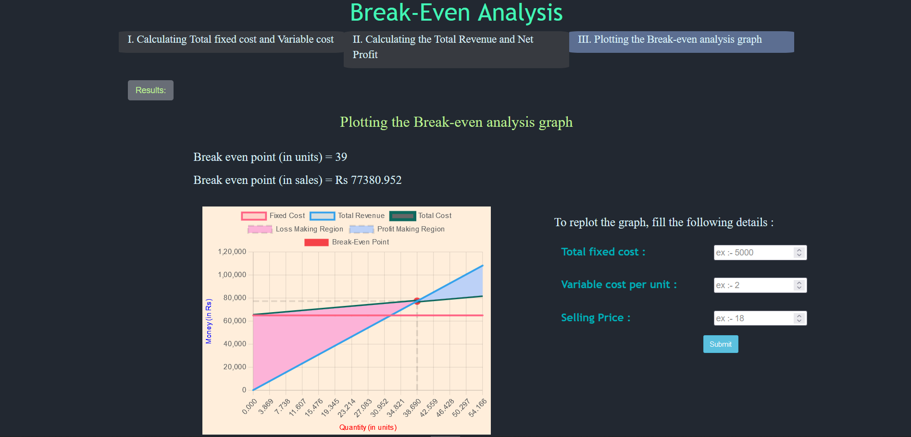
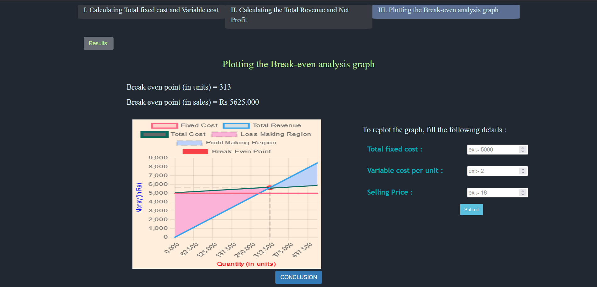
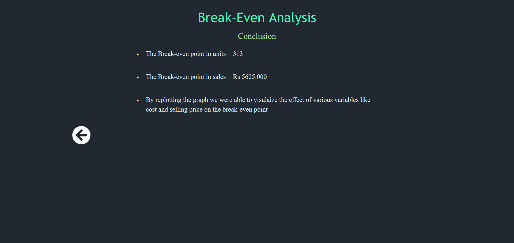

##### These procedure steps will be followed on the simulator

1. After going through the theory and pretest, click the "Simulation" tab 

2. Click "Submit" button to verify the answers given, click on simulator button to skip the test and go to simulator. 
<!--   -->
3. Read the objective and definitons and click on the "Start" button to proceed. 
 
4. Click on "calculating total fixed cost and variable cost", input the values and click on "Submit" 
 
5. Click on "calculating total revenue and net profit" and click on the "Formulae" button to get formulas 
 
6. Input the values of selling price and quantity and calculate all the values and click on "Submit" 
 
7. Click on "Results" to check all the calculated values. 
 
8. Click on "plotting the break-even analysis graph" and analyse the graph. 
 
9. Input the values to replot the graph and visualize the effects of each variable on the break-even point and click on "Submit" button. 
 
10. Click on "Conclusion" and understand the conclusions
 

