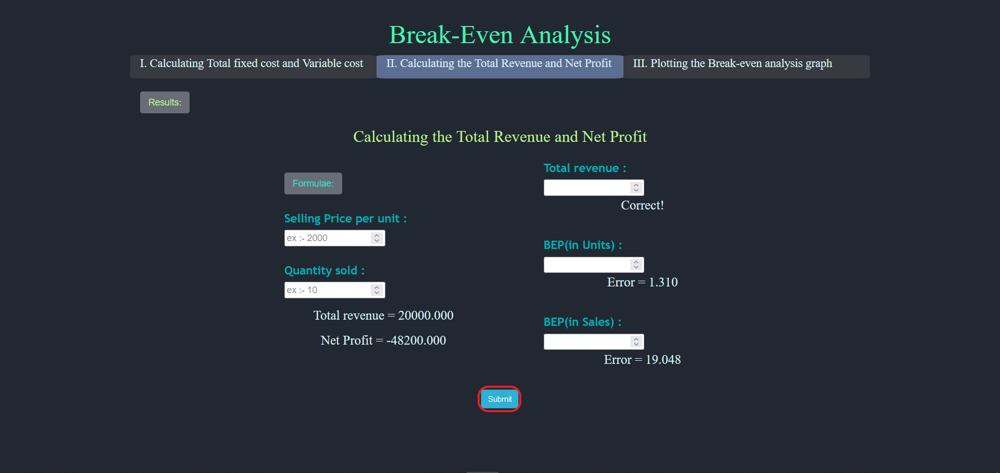

#### These procedure steps will be followed on the simulator

1. Read the objective and definitons of the experiment and click on the "Start" button to proceed. 
 

2. Click on "calculating total fixed cost and variable cost", input the values and click on "Submit" 
 

3. Click on "calculating total revenue and net profit" and click on the "Formulae" button to get formulae 
 

4. Calculate the values using formulae and click on "Close" to close the formulae tab.  

5. Input the values of selling price and quantity and calculate all the values and click on "Submit" 
 

6. Click on "Results" to check all the calculated values. 
 

7. Check the result values and click on "Close" to close the tab 
 

8. Click on "plotting the break-even analysis graph" and analyse the graph. 
 

9. Input the values to replot the graph and visualize the effects of each variable on the break-even point and click on "Submit" button. 
 

10. Click on "Conclusion" and understand the conclusions.  
 

11. Click on back arrow to return to Graph analysis page.  
 

