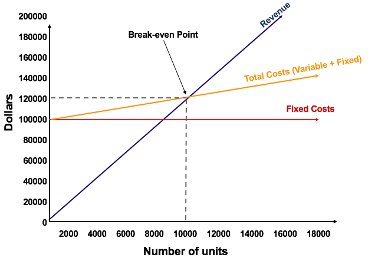

### INTRODUCTION  

*
Break Even Analysis in economics, business, and cost accounting refers to the point in which total cost and total revenue are equal. A break even point analysis is used to determine the number of units or rupees of revenue needed to cover total costs (fixed and variable costs).
*

#### KEY TERMS
- **Fixed cost** : Fixed costs remain fixed in the short-run. Examples are rent, insurance, depreciation, factory supervisor's salaries, directors' salaries, and so on.
- **Variable costs** : The variable cost per unit vary with the volume of production. The variable costs
include cost of direct materials, direct labour, direct expenses, operating supplies such as lubricating
oil, and so on.
- **Total cost** : The total of fixed and variable costs.
- **Total revenue** - The sales proceeds (selling price per unit x number of units sold).
- **Net Profit** - The total profit is calculated as Total Revenue - (Variable Cost Per Unit * Quantity) - Fixed Cost

 

### FORMULA

*Break even (in units)* = **Fixed costs / (Sales price per unit – Variable cost per unit)**

*Break even (in sales)* = **(Fixed costs * Sales price per unit) / (Sales price per unit – Variable cost per unit)**

Where:
-  **Fixed costs** are costs that do not change with varying output (e.g., salary, rent, building machinery).
- **Sales price per unit** is the selling price (unit selling price) per unit.
- **Variable cost per unit** is the variable costs incurred to create a unit.

 

### GRAPHICAL REPRESENTATION

 The graphical representation of unit sales and rupees sales needed to break even is referred to as the break even chart. The point of intersection of the total cost line and the total revenue line is called the break even point.

**Below is an examle of a break even chart:** 
 

 

### ADVANTAGES

- **Make or buy decision:**
The break-even analysis assists in making a choice between two courses of action to make versus to buy. If the variable cost is less than the price that has to be paid to an outside supplier, it may be better to manufacture than to buy.

- **Production planning:** The break-even analysis helps in planning the production of items giving maximum contribution towards profit and fixed costs.

- **Cost control:**
As a cost control device, the break-even analysis can be used to detect insidious upward creep of costs that might otherwise go unnoticed.

- **Financial structure:** Break-even analysis provides an understanding of the behaviour of profits in relation to output. This understanding is significant in planning the financial structure of a company.

- **Conditions of uncertainty:** When some reasonable basis for subjective extrapolation is available, the break­even analysis provides the financial management with information helpful in its decision-making activities.

 

### LIMITATIONS
- The Break-even analysis is only a supply-side (i.e., costs only) analysis, as it tells you nothing about what sales are actually likely to be for the product at these various prices.

- It assumes that fixed costs (FC) are constant. Although this is true in the short run, an increase in the scale of production is likely to cause fixed costs to rise.

- It assumes average variable costs are constant per unit of output, at least in the range of likely quantities of sales. (i.e., linearity).

- It assumes that the quantity of goods produced is equal to the quantity of goods sold (i.e., there is no change in the quantity of goods held in inventory at the beginning of the period and the quantity of goods held in inventory at the end of the period).

- In multi-product companies, it assumes that the relative proportions of each product sold and produced are constant (i.e., the sales mix is constant).